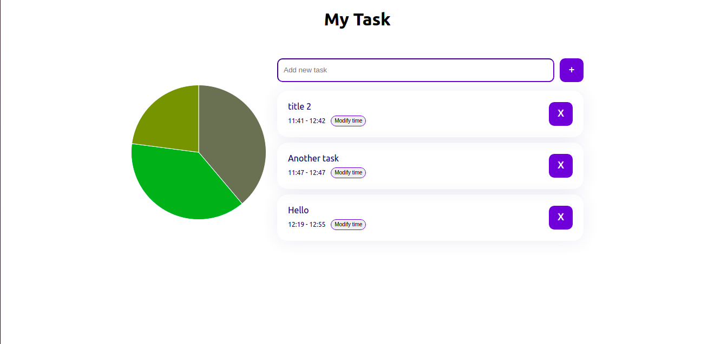

# AllioFintech demo task

## Overview

A simple app that can plan for the day

The following are what a user can do.

* **Add Task**
* **Remove an existing task**
* **Assign or Modify Time Box**

## Tools

* Typescript
* NextJs
* Redux and Redux thunk
* @Emotion
* ChartJS
* Moment

This is what it looked like:

## Building

### Prerequisites

The latest minor version of node 8LTS with the bundled npm version are recommended to run the project. At the moment of
writing the project was built with node v8.16.1 and npm v6.4.1.

### Getting started

Install the dependencies

`npm install`

### Run commands

`npm run dev` - To start the application in development mode. The port is 3000 by default
`API_URL` env. variable.

`npm test` - To run test for the code

`npm run lint` - To perform code style check
